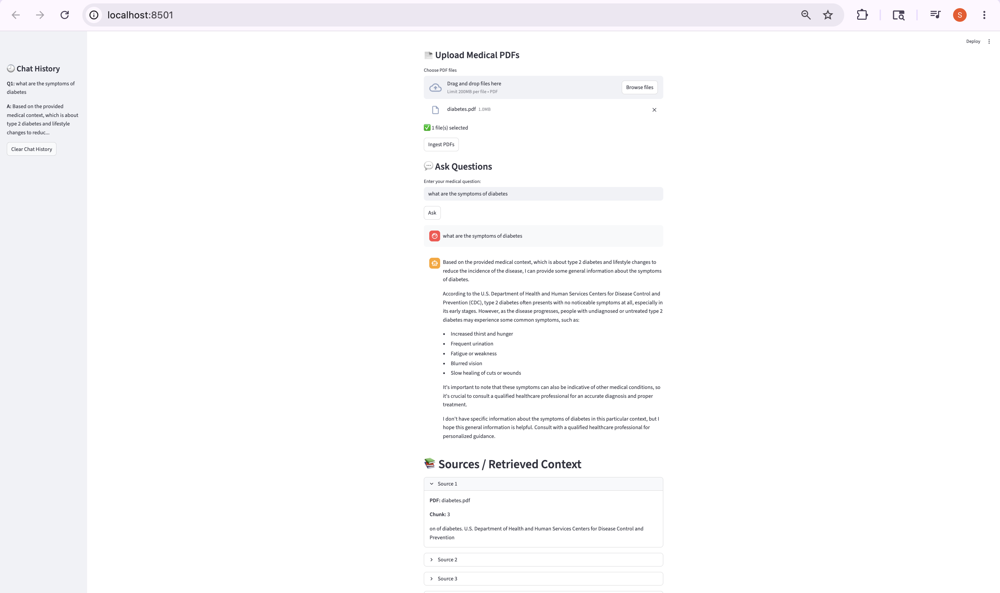
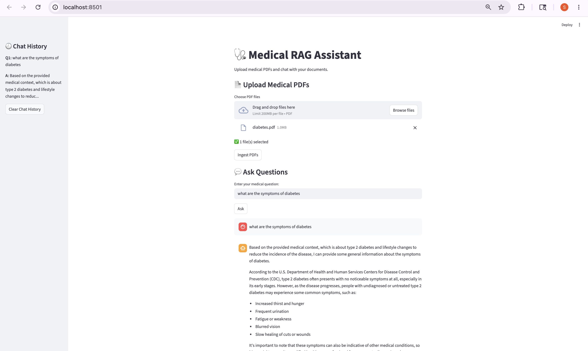
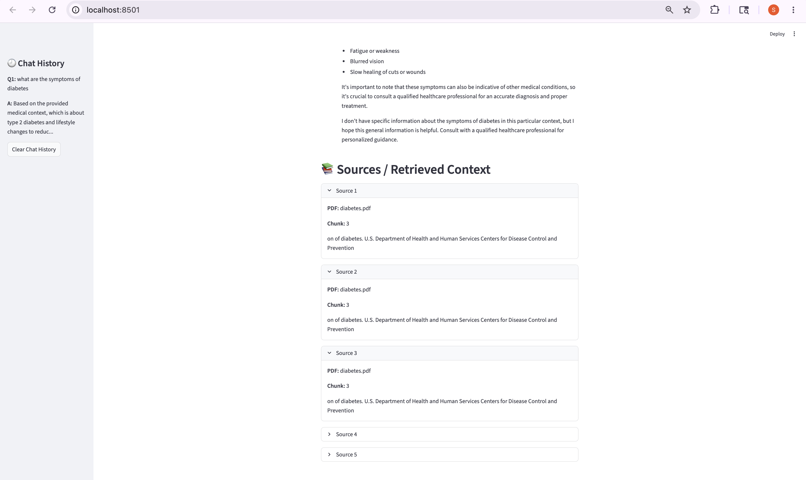
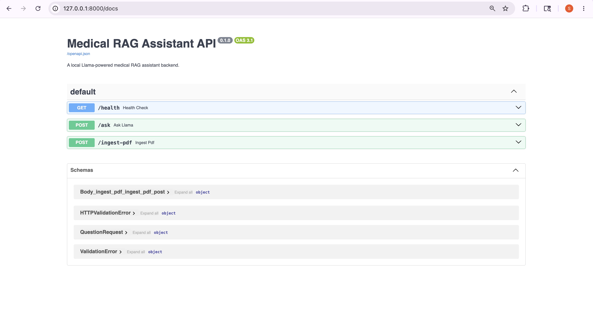

# 🩺 Medical RAG Assistant

A conversational AI-powered Medical RAG (Retrieval-Augmented Generation) Assistant that allows users to upload medical PDF documents and ask questions based on their content.

The system uses semantic search with embeddings and a vector database to retrieve relevant document chunks and generate grounded responses using a local LLM powered by Ollama.

---

# 🚀 Features

- 📄 Upload and ingest multiple medical PDFs
- 🧠 Conversational RAG with chat memory
- 🔍 Semantic search using embeddings
- 📚 ChromaDB vector database integration
- 🤖 Local Llama3 inference using Ollama
- 💬 Streamlit conversational chat interface
- 📖 Source citations and retrieved context display
- ⚡ FastAPI backend APIs
- 🧩 Modular backend architecture
- 📑 Swagger API documentation
- 🗂 Expandable source cards in UI

---

# 🛠 Tech Stack

## Frontend
- Streamlit

## Backend
- FastAPI
- Python

## AI / NLP
- Ollama
- Llama3
- Sentence Transformers

## Vector Database
- ChromaDB

## PDF Processing
- Pypdf

---

# 🏗 Architecture

```text
User Uploads PDF
        ↓
PDF Text Extraction
        ↓
Text Cleaning
        ↓
Chunking
        ↓
Embedding Generation
        ↓
ChromaDB Vector Store
        ↓
Semantic Retrieval
        ↓
Llama3 Prompting
        ↓
AI Response with Sources
```

---

# 📂 Project Structure

```text
medical_RAG_assistant/
│
├── assets/
│   ├── upload-success.png
│   ├── chat-answer.png
│   └── swagger-docs.png
│
├── backend/
│   ├── app/
│   │   ├── routes/
│   │   ├── services/
│   │   ├── schemas/
│   │   └── main.py
│   │
│   ├── uploaded_files/
│   ├── chroma_db/
│   ├── requirements.txt
│   └── .env
│
├── frontend/
│   └── app.py
│
├── README.md
└── .gitignore
```

---

# 📸 Screenshots

## PDF Upload and Ingestion


---

## Chat With Medical Documents






---

## Swagger API Documentation



---

# ⚙️ Installation

## 1. Clone Repository

```bash
git clone https://github.com/shivanisindhe3/medical-rag-assistant.git
```

---

## 2. Navigate to Project

```bash
cd medical-rag-assistant
```

---

# 🔧 Backend Setup

## 1. Navigate to Backend

```bash
cd backend
```

---

## 2. Create Virtual Environment

```bash
python -m venv .venv
```

---

## 3. Activate Virtual Environment

### Mac/Linux

```bash
source .venv/bin/activate
```

### Windows

```bash
.venv\Scripts\activate
```

---

## 4. Install Dependencies

```bash
pip install -r requirements.txt
```

---

## 5. Run FastAPI Backend

```bash
uvicorn app.main:app --reload
```

Backend runs at:

```text
http://127.0.0.1:8000
```

Swagger docs:

```text
http://127.0.0.1:8000/docs
```

---

# 🎨 Frontend Setup

## 1. Navigate to Frontend

```bash
cd frontend
```

---

## 2. Run Streamlit App

```bash
streamlit run app.py
```

Frontend runs at:

```text
http://localhost:8501
```

---

# 🤖 Ollama Setup

Install Ollama:

https://ollama.com

Pull Llama3 model:

```bash
ollama pull llama3
```

Run Ollama locally before starting backend.

---

# 💡 Example Questions

- What are the symptoms of diabetes?
- How can diabetes be prevented?
- What lifestyle changes are recommended?
- What does the document say about prediabetes?
- What are the risk factors?

---

# 📈 Future Improvements

- 🌐 Cloud deployment
- 🔐 User authentication
- 📊 Retrieval similarity scores
- ⚡ Streaming AI responses
- 🧾 OCR support for scanned PDFs
- 🐳 Docker support
- 🔎 Hybrid keyword + vector search

---

# 👩‍💻 Author

Shivani Sindhe

GitHub:
https://github.com/shivanisindhe3

---

# ⭐ Project Highlights

This project demonstrates:
- Retrieval-Augmented Generation (RAG)
- Conversational AI memory
- Semantic document retrieval
- Vector databases
- LLM integration
- FastAPI backend engineering
- Streamlit frontend development
- End-to-end AI application development